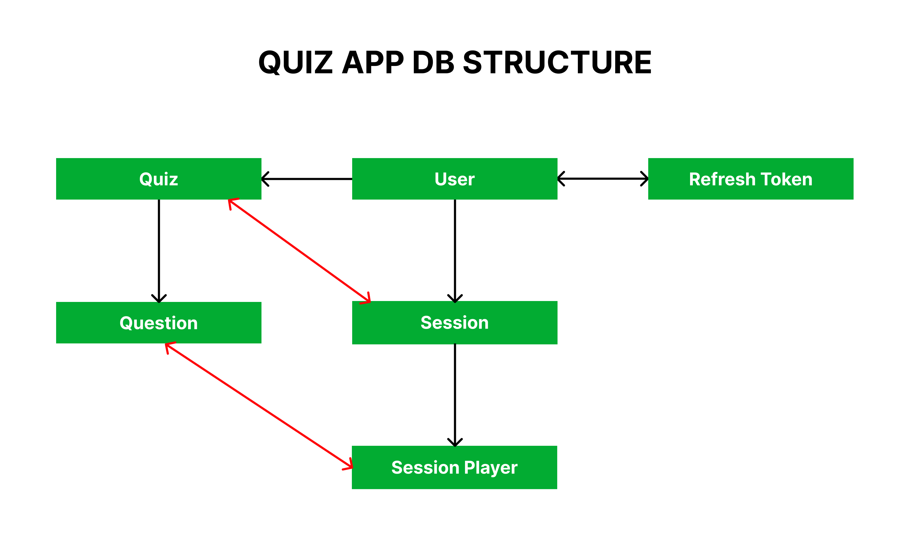
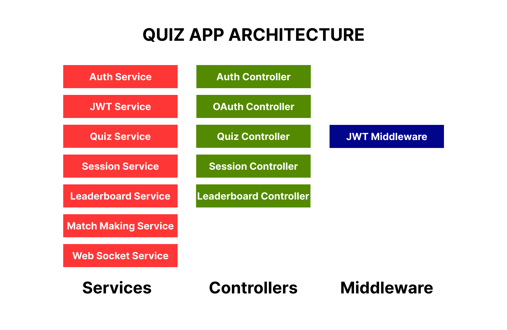

# 🧠 Realtime Multiplayer Quiz Backend

A **realtime multiplayer quiz backend** built with AdonisJS and TypeScript.
This project supports **synchronized gameplay**, **live score updates**, and **dynamic rankings** across multiple players in a shared session.

---

## Screenshots

|                                      |                                      |
| ---------------------------------------------- | ---------------------------------------------- |
| .png)  | .png)  |
| .png)  | .png)  |
| .png)  | .png)  |
| .png)  | .png) |
| .png) | .png) |
| .png) | .png) |
| .png) | .png) |
| .png) | .png) |
| .png) | .png) |
| .png) | .png)                                      


## 🚀 Feature Completeness

### 🔐 Authentication

* Email/Password & Google OAuth Authentication
* Secure password hashing
* JWT-based authentication (Access + Refresh tokens)


### 👤 User Profile Management fully 

* Upload / Change profile picture
* View and update profile information

### 🧩 Quiz Management

* Play Solo Quiz
* Play Multiplayer Quiz
* See Realtime Updates In Leaderboard
* Get Notifications / Score updates whenever someone submits correct answer
* A global leaderboard for tracking solo and multiplayer wins

### 🎮 Advanced Matchmaking (BONUS 1)
* A public waiting lobby where people can join and wait for quiz to start
* Whenever 2 people join lobby, quiz is started

### 🎮 Quiz Content Management (BONUS 2)
* Each user can create and update custom quizzes
* Those quizzes can be used in solo vs multiplayer sessions

### 🎮 Test Cases (BONUS 3)
* Auth API Test Cases: tests/functional/auth.spec.ts
* Quiz API Test Cases: tests/functional/quiz.spec.ts


## ✅ Deliverables
* GitHub repository with meaningful committ messages and branches
* Web UI made using ReactJS
* README.md
* Problems & Solutions: [View](https://github.com/ishantchauhan710/realtime-quiz/blob/main/ProblemsSolutions.md)
* Postman Collection: [Open](https://.postman.co/workspace/My-Workspace~a63831ce-52af-4eea-84fc-3f9941ece80a/collection/13582586-ef9ab34d-9f0e-4af0-a4b2-4c8a69c02fcd?action=share&creator=13582586)

## 🚀 Architecture






### 🎮 Solo Game Play Flow
1. User selects and starts quiz
2. A Session model instance is created which represents a single game (solo | multiplayer)
3. A SessionPlayer model instance is created which represents a game player. It keeps track of total score and what question num of quiz user is currently answering (using currentQuestionIndex)
4. If no currentQuestionIndex+1, it means quiz has ended and if user answered all correctly, update stats to User model

### 🎮 Multiplayer Game Play Flow
1. UserA creates a room in UI
2. A Session and SessionPlayer model instance is created for UserA
3. UserB joins that room in UI
4. A SessionPlayer model instance is created for UserB
5. UserA clicks on Start Quiz in UI
6. A socket event 'start_quiz' starts the 5 seconds countdown
7. A socket event 'game_countdown' and 'game_start' ensures each player's quiz starts at same time
8. A question_start socket event starts sending questions to clients
9. A submit_answer event is sent from frontend with user's selected answer to see if user answered correctly
10. Socket event answer_result tells if it was correct or incorrect
11. Socket event score_update triggers notifications in room whenever someone answers correctly
12. A setTimeout() event handles if user missed question, it is marked unanswered and next question is shown
13. If no next question for SessionPlayer it means quiz is completed and quiz_completed event is emitted to make frontend UI changes
14. For realtime leaderboard, whenever someone submits an answer from UI, submit_answer event is triggered. It is processed by quizService.submitAnswer(). It keeps updating score in SessionPlayer. Then gets all SessionPlayers in Session and sorts them in high to low score order and returns a fresh leaderboard which is shown to frontend using score_update event.

### 🎮 Lobby Flow
1. When a user joins lobby, join_lobby socket event is emitted and player is added to a queue/
2. Every 5 seconds it is checked if queue has min 2 people then for those 2 pairs a room is created using sessionService.createMatchmakingSession()
3. Rest flow similar to Multiplayer Game Play Flow


## 🚀 Tech Stack And Libraries Used
1. AdonisJS (Backend)
2. Typescript (For better type handling)
3. Socket.IO (For realtime communication)
4. SQLite (I chose SQLite for simplicity and quick setup since the assignment focuses on backend design and real-time logic. For production, I would switch to PostgreSQL to handle concurrency and scaling.)
5. Vine (For backend request body data validation)
6. ReactJS (For frontend)

## 🎮 Project Setup
Clone the repo and run 
```
cd server
npm install
node ace migration:run
cd ../frontend
npm install
```

## ✅ Environment File Setup
Create .env file in server folder and there paste:
```
# Node
TZ=UTC
PORT=3333
HOST=localhost
NODE_ENV=development

JWT_SECRET=PASTE_HERE
JWT_REFRESH_SECRET=PASTE_HERE

# App
LOG_LEVEL=info
APP_KEY=5T3ByhAoe0O-DEyDfUXpL49PMTc8cWyS
APP_URL=http://${HOST}:${PORT}

# Session
SESSION_DRIVER=cookie

#--------------------------------------------------------------------
# CORS (configure allowed origins for API access)
#--------------------------------------------------------------------
# CORS_ORIGIN=http://localhost:5173,http://localhost:3000
DB_HOST=127.0.0.1
DB_PORT=5432
DB_USER=root
DB_PASSWORD=root
DB_DATABASE=app
GOOGLE_CLIENT_ID=PASTE_HERE
GOOGLE_CLIENT_SECRET=PASTE_HERE

```

* Set JWT_SECRET and JWT_REFRESH_SECRET to any random string
* GOOGLE_CLIENT_ID and GOOGLE_CLIENT_SECRET you need to get from google cloud console

## ⚠️ Limitations & Future Improvements

Due to time constraints, some edge cases and optimizations were not fully implemented. However, I am aware of these areas and how they can be improved:

1. **Type Safety Improvements**

   Some parts of the codebase use `any` in TypeScript. This can be improved by defining proper request/response DTOs to ensure strong type safety and better alignment with frontend contracts.

2. **Session Resume on Reload**

   Currently, if a user refreshes during an ongoing game, their session is lost.
   This can be enhanced by:

   * Storing session state in frontend (e.g., localStorage)
   * Implementing a `resume_session` socket event to restore user state and rejoin the active session seamlessly

3. **Session Cleanup Strategy**

   Old sessions and related player data are not automatically deleted.
   This can be handled by:

   * Running a scheduled CRON job to remove expired sessions
   * Or cleaning up immediately after a session is completed

4. **Database Optimization**

   In some places, database operations are executed inside loops, which is not optimal.
   This can be improved by:

   * Using bulk queries or optimized SQL
   * Leveraging `Promise.all` for parallel execution to reduce latency

5. **Player Disconnect Handling**

   If a player leaves before the game starts, they may still appear in the room.
   This edge case can be handled by:

   * Listening to socket `disconnect` events
   * Removing the corresponding `SessionPlayer` entry

6. **Improved Synchronization Model**

   Although the current implementation starts all players simultaneously in sync, but each player progresses with their own individual timer which starts at same point. A more robust and scalable approach would be:

   * Using a **single server-controlled timer per session**
   * Broadcasting questions to all players simultaneously
   * Revealing correct answers after a fixed duration before moving to the next question
     This ensures stronger synchronization however one would need to wait full 10 seconds to move to next question.

7. **Code Reusability & DRY Principles**

   Some utility logic (e.g., response formatting, socket helpers, user fetch utilities) could be better abstracted.
   With more time, these would be refactored into reusable services and helper functions to improve maintainability.

